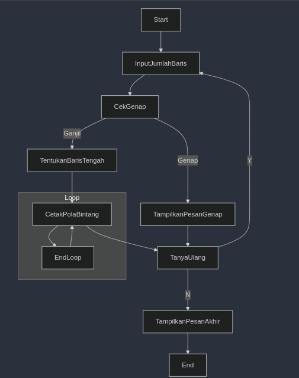

# **Program Cetak Pola Bintang dengan Input Ganjil**

## **Deskripsi Program**
Program ini dirancang untuk mencetak pola bintang berdasarkan input bilangan ganjil dari pengguna. Jika pengguna memasukkan bilangan genap, program akan meminta pengguna untuk memasukkan bilangan ganjil. Program ini juga memberikan opsi kepada pengguna untuk mengulang proses atau mengakhiri program.

---

## **Cara Kerja Program**
1. Pengguna diminta untuk memasukkan jumlah baris.
2. Program memeriksa apakah input adalah bilangan ganjil.
   - Jika **genap**, program meminta input ulang.
   - Jika **ganjil**, program mencetak pola bintang:
     - Baris tengah memiliki jumlah bintang sebanyak input.
     - Baris lainnya hanya memiliki 1 bintang.
3. Setelah selesai mencetak pola, pengguna ditanya apakah ingin mengulang program.
   - Pilih `Y` atau `y` untuk mengulang.
   - Pilih `N` atau `n` untuk keluar.
4. Program menampilkan pesan penutup dan selesai.

---

## **Struktur Program**
### **Fungsi Utama**
1. **`main()`**: 
   - Mengelola input pengguna, validasi, dan pengulangan program.
   - Memanggil fungsi `printStars` untuk mencetak pola bintang.

2. **`printStars(int n)`**:
   - Bertanggung jawab mencetak pola bintang sesuai jumlah baris (`n`).

---

## **Pola Output**
### **Contoh Input dan Output**

#### **Kasus 1: Input Ganjil**
Input: `Jumlah baris? 5`  
Output:  
```
Bintang(5):
*
*
*****
*
*
Apakah anda ingin mengulang Program (Y/N): N
Terima kasih telah menggunakan Program ini.
```

#### **Kasus 2: Input Genap**
Input: `Jumlah baris? 6`  
Output:  
```
Anda memasukkan jumlah Genap. Masukkan hanya jumlah Ganjil
Apakah anda ingin mengulang Program (Y/N): Y
Jumlah baris? 3
Bintang(3):
*
***
*
Apakah anda ingin mengulang Program (Y/N): N
Terima kasih telah menggunakan Program ini.
```

---

---

## **Algoritma Program**


---

## **Petunjuk Kompilasi dan Eksekusi**
1. Simpan kode dalam file dengan nama, misalnya `print_star.cpp`.
2. Kompilasi program menggunakan perintah:
   ```bash
   g++ -o print_star print_star.cpp
   ```
3. Jalankan program:
   ```bash
   ./print_star
   ```